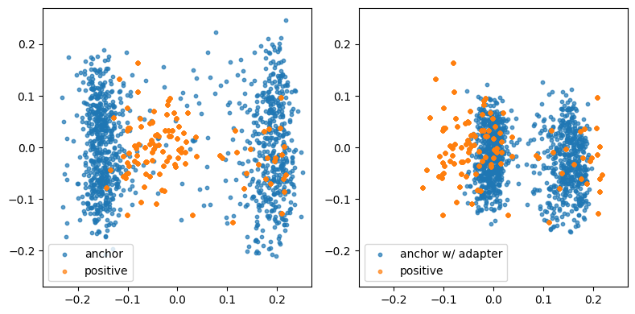

# Bar Hopping Route Recommender

    
     
    

    Tired of the same old watering holes? Craving a night of diverse vibes and tantalizing tipples?
     <strong>
    RunTini redefines nightlife by pairing curated bar experiences with a guided night run. </strong>🍸🏃‍♂️
     
    <a href="https://github.com"><strong>Explore the repo and see how we’re turning bar-hopping into a true journey »</strong></a>
     
      
    

    
    
    
    
    
    
    
    
    

### Table of Contents
* **🍻 About RunTini - Your Night, Your Route**
    * 🍿 [Demo Video - Watch it in Action!](#1-1)
    * ✨ [How It Works - The Magic Behind the Crawl](#1-2)
    * 🧩 [Built With - The Secret Sauce](#1-3)

* **🚀 Getting Started - How to Unleash the Fun**
    * ⚙️ [Prerequisites - What You'll Need in Your Toolkit](#2-1)
    * ⚡ [Installation - Setting Up Your Adventure](#2-2)

* **🗺️ Roadmap - Future Cocktails**
    * 🌱 [Short-Term Goals](#3-1)
    * 🔮 [Long-Term Vision](#3-2)

* **📜 License - Cheers to Open Source**

* **💬 Contact - Holler At Us**

## 🍻 About RunTini - Your Night, Your Route

Tired of scrolling bar reviews, trying to plan the perfect night out? Meet RunTini – your nightlife wingman with a runner’s high. We mix curated bar vibes with a 3–5 mile night run, turning your night into a drink-fueled adventure. Whether you’re chasing moody whiskey dens, electric cocktail spots, or beer-soaked pubs, we map out five epic stops and the route to hit them all.

<strong>Run. Sip. Repeat.</strong>
 
This isn’t just bar-hopping—it’s bar-running. Let’s make your night legendary (and slightly sweaty).

### 🍿 Demo Video - Watch it in Action!

### ✨ How It Works - The Magic Behind the Crawl

Our system orchestrates your perfect bar hop with a blend of advanced AI and geographical wizardry:

* **❓ User Query Analysis - Your Wish is Our Command:**  
You input your desired bar characteristics (e.g., "speakeasy vibe with craft cocktails"). This natural language query is the starting point of our search.

* **🧠 Gemma 3 - Contextual Review Summarization:**  
We leverage the powerful multimodal model to process and condense extensive user reviews and visual data from Google Maps for numerous bars. This provides nuanced insights into each venue's atmosphere, offerings, and overall experience, going beyond simple ratings.

* **🧬 Vector Embedding and Similarity Search - Finding Your Tribe:**  
The summarized review text for each bar is transformed into high-dimensional vector embeddings, capturing the semantic meaning of the bar descriptions to identify bars with the most semantically similar descriptions.

* **🔑 Embedding Adaptation - The Hit Rate Hero:** 
To bridge potential vocabulary gaps between user queries and bar reviews, we employ a linear adapter layer attached to the embedding model. This adapter learns a transformation matrix that fine-tunes the query embeddings, specifically improving the hit rate of relevant bars from 56% to 76%. This is achieved by better aligning the semantic representation of user intent with the embedded bar descriptions, leading to a higher recall in the initial search.

    

* **📊 Reranking with Cross-Encoder - The Precision Pour:** 
The initial set of candidate bars undergoes a reranking stage using a more computationally intensive cross-encoder model which directly compares the user query with each candidate bar's full review summary, predicting a relevance score. This step ensures that the top recommendations are not only semantically similar but also highly pertinent to the specific nuances of your request.

* **🚶 Hamiltonian Path Optimization - The Route Master:** 
With the top 5 bars selected, we model the bar locations as nodes in a graph and solve the Hamiltonian Path Problem. Our goal is to devise an efficient and enjoyable route that prioritizes a linear progression through different streets, minimizing backtracking and maximizing the exploration of new areas between your chosen bars.

* **🚚 Gradio Interface - Your Night, Delivered:**  
Finally, the curated list of 5 bars, along with the optimized bar-hopping route, is presented to you through a user-friendly web interface built with Gradio. This interface allows you to easily view bar details, the suggested route, and embark on your personalized drinking adventure.

### 🧩 Built With - The Secret Sauce

We've concocted RunTini with a potent blend of these amazing technologies:

| Technology                                  | Role                                                                      |
| :------------------------------------------ | :------------------------------------------------------------------------ |
|  | The intelligent core for understanding bar vibes from user reviews and photos. |
|  | Transforms summaries into searchable insights, the key to finding your perfect match. |
|                 | Powers the generation of natural-sounding user queries, enhancing our search precision. |
|  | The final touch, ensuring only the top-notch recommendations make it to you.     |

(<a href="#readme-top">back to top</a>)

## 🚀 Getting Started - How to Unleash the Fun
Ready to let RunTini plan your next unforgettable night out? Here's how to get started:

### ⚙️ Prerequisites - What You'll Need in Your Toolkit
Before you can embark on your RunTini adventure, make sure you have the following installed:

### ⚡ Installation - Setting Up Your Adventure
Follow these steps to get RunTini up and running:

(<a href="#readme-top">back to top</a>)

## 🗺️ Roadmap - Future Cocktails
We're always looking to enhance your bar-hopping experience! Here are some exciting features we're planning for the future:

### 🌱 Short-Term Goals

* **Real-time Bar Information:**  
Integrate real-time data on bar crowd levels and potential wait times to help users make more informed decisions about which bars to visit and optimize their bar-hopping experience in real-time.

* **Mobile Apps & Community Route Sharing:**  
Build native mobile apps that integrate RunTini's core functionality with features for users to create, share, and discover bar-hopping routes within the community.

### 🔮 Long-Term Vision

* **Feedback-Driven Personalization:**  
Integrate feedback mechanisms (e.g., thumbs up/down on recommendations, saving routes) to build user profiles and improve future route suggestions.

(<a href="#readme-top">back to top</a>)

## 📜 License - Cheers to Open Source
Distributed under the Unlicense License. See LICENSE.txt for more information. This means you're free to use, modify, and distribute RunTini as you see fit – no strings attached!

(<a href="#readme-top">back to top</a>)

## 💬 Contact - Holler At Us
Have questions, suggestions, or just want to share your favorite bar crawl story? Feel free to reach out!

✈️ **Hsin Chen** - hsinchen@stanford.edu
 
☕ **Justin 自己寫** -
 

**Project Link**: https://github.com/hsinchen22/RunTini

(<a href="#readme-top">back to top</a>)

