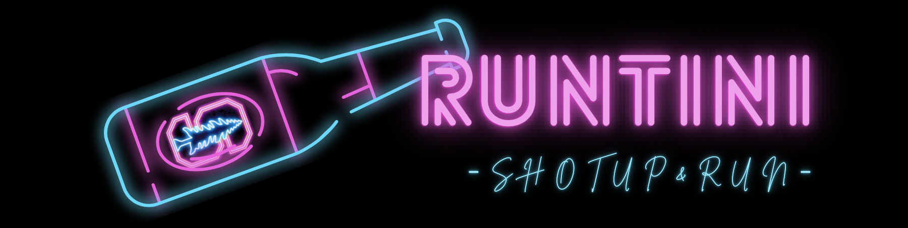

<!-- PROJECT BANNER -->

<!-- TABLE OF CONTENTS -->

	
Table of Contents

	<ol>
		<li>
			<a href="#about-the-project">About The Project</a>
			<ul>
				<li><a href="#built-with">Built With</a></li>
			</ul>
		</li>
		<li><a href="#license">License</a></li>
		<li><a href="#contact">Contact</a></li>
	</ol>

<!-- ABOUT THE PROJECT -->

<!-- LICENSE -->
## License
Distributed under the Unlicense License. See `LICENSE.txt` for more information.

(<a href="#readme-top">back to top</a>)

<!-- CONTACT -->
## Contact
Hsin Chen - hsinchen@stanford.edu
Project Link: [https://github.com/hsinchen22/RunTini](https://github.com/hsinchen22/RunTini)

(<a href="#readme-top">back to top</a>)

